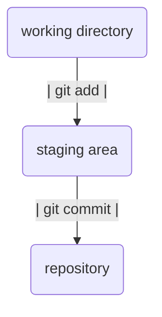

##  Git 명령어
- 워킹 트리 ( Working tree ) - Git  에서 초기화된 폴더
- Staging Area : commit을 위한 공간.
- 레파지토리 ( Repository )- commit된 작업 데이터가 저장되어 있는 곳.

- git init '.git'  폴더를 생성한다. 특정 폴더 초기화한다.,
- git add :  staging area에 올린다.
	- git add . : working directory 내에 있는 모든 파일을 올려라.
- git commit  특정 시점의 파일을 저장해두는 것.2
- git status  :  working directory 영역과 stage 영역의 폴더 확인.
- git remote show origin
	- origin - git 주소를 담는다.
- git push origin main : git 주소 origin 에 main 을 담는다.
- git pull : 
```
  438  git init
  441  git status
  442  git add .
  443  git status
  444  git commit -m "first commit"
  445  git status
  446  git remote add origin "https://github.com/osm3735/git_test2.git"
  447  git remote show origin
  448  git push origin main
```

- git log : commit 된 데이터를 확인.
